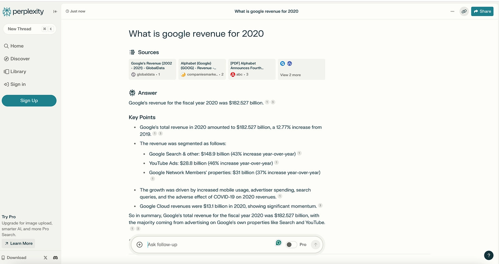

# Building an AI-Powered Conversational Search: Inside Perplexity.ai's Technology Stack

---

Ever wonder how some search engines just *get* what you're asking, while others throw a bunch of blue links at you and wish you luck? That's the difference between traditional search and what Perplexity.ai is doing. They're not just matching keywords—they're actually having a conversation with you, figuring out what you really want to know, and then summarizing the answer with sources you can check. It's like having that one friend who always knows stuff and can explain it without making you feel dumb.

---

## What Makes Perplexity Different (And Why You Should Care)

So here's the thing about Perplexity. You type in a question—any question, the way you'd actually ask it—and instead of getting ten pages of search results you'll never click through, you get an actual answer. With sources. In brackets. Like a mini research paper, except it doesn't take three hours and four cups of coffee.

The magic happens because Perplexity combines natural language processing, large language models, and real-time web crawling. But let's not get ahead of ourselves. Let me walk you through how this whole thing actually works.

## How It Works When You're Just Trying to Find Something

Picture this: You're searching for something. Maybe it's "best practices for remote team management" or "why does my sourdough starter smell like nail polish remover." You type it in.

**First**, Perplexity reads your question like a human would. Not just picking out keywords, but understanding what you're actually asking. Intent matters here.

**Second**, it might ask you follow-up questions. "Are you managing a small team or a large organization?" This isn't annoying—it's actually helpful because it means you're not getting generic advice meant for everyone and no one.

**Third**, you get a summarized answer pulled from multiple sources across the web. Not just links. An actual answer. And those little bracketed numbers? Those are your sources. Click them if you want to dig deeper. Don't click them if you trust the summary. Your choice.

**Fourth**, it remembers. If you asked about remote team management yesterday and come back today asking about video conferencing tools, Perplexity connects the dots. Context matters.

The free version uses GPT-3.5 combined with Perplexity's own model. Pay for Pro, and you get access to GPT-4, Claude 3, Mistral Large, and Llama 3. More horsepower under the hood.

## The Tech Stack (Without the Jargon Overload)

Let's talk about what's actually running behind the scenes. Because if you're building AI products or just trying to understand how modern search works, this stuff matters.

### Their Own Language Models

Perplexity didn't just slap GPT-4 on a website and call it a day. They built their own models: **pplx-7b-online** and **pplx-70b-online**. The numbers? That's how many parameters they have—7 billion and 70 billion, respectively. More parameters generally means better understanding, though it's not quite that simple.

These models started with open-source foundations (mistral-7b and llama2-70b), but Perplexity fine-tuned them with their own training data. The goal: make them better at being helpful, factual, and current. Because what good is an AI that gives you outdated information or makes stuff up?

Here's the clever part: these models connect to Perplexity's own search and indexing technology. So when you ask a time-sensitive question—like "what happened in the market today"—the model pulls fresh information from the web, not just from whatever it learned during training months ago.

### Mixing Multiple Models (Because Why Choose?)

Perplexity uses an ensemble approach. Free users get GPT-3.5 plus pplx-7b. Pro users get GPT-4, Claude 3, Mistral Large, Llama 3, and pplx-70b. Different models have different strengths, so combining them means better, more comprehensive answers.

It's like having multiple experts in the room instead of just one. Sometimes GPT-4 nails it. Sometimes Claude has a better take. The system figures out which model (or combination) works best for your specific question.

### Fine-Tuning on Real Data

Generic language models are impressive, but they're not optimized for search. Perplexity fine-tunes its models on curated datasets specifically designed to test helpfulness, factual accuracy, and the ability to cite sources correctly.

They evaluate performance on custom benchmarks: Can the model cite sources accurately? Does it give factual responses? Can it incorporate the latest web information? This isn't just training an AI to sound smart—it's training it to be useful and trustworthy.

### The Conversational Layer

This is where things get interesting. Perplexity doesn't just answer your question and move on. It asks clarifying questions. It maintains context across your conversation. It remembers what you asked before.

This conversational approach means the system can narrow down exactly what you need. Instead of giving you a generic answer about "team management," it can give you specific advice for managing a remote design team of five people in different time zones. 👉 [See how conversational AI transforms traditional search into an interactive experience](https://pplx.ai/ixkwood69619635)

## Design Principles That Actually Make Sense

Let's talk about how Perplexity thinks about product design. Because having great technology means nothing if the experience sucks.

### Conversation Over Keywords

Traditional search engines want keywords. Perplexity wants to understand what you're actually trying to accomplish. You can type "I'm trying to figure out why my houseplant keeps dying even though I water it every day" and it'll understand that you're probably overwatering, not underwatering.

### Transparency Through Citations

Every answer includes inline citations. Those bracketed numbers aren't just decoration—they're your proof. Click them and you'll see exactly where the information came from. This builds trust. You're not just taking the AI's word for it.

### No Ads, No Sponsored Results

Here's a radical idea: what if search results were ranked by relevance instead of who paid the most? Perplexity doesn't show ads. The free tier exists. The Pro tier costs money. That's the business model. Simple.

This means when you search for "best project management software," you're getting actual recommendations based on web sources, not a list of whoever bought ads that day.

### Personalization That Learns

The "Your Threads" feature saves your previous conversations. Come back later and pick up where you left off. The system learns your preferences, your interests, the way you phrase questions.

The "Copilot" feature (powered by GPT-4) guides you through complex searches, asking the right follow-up questions to narrow down exactly what you need. It's like having a research assistant who actually pays attention.

### Mobile-First Design

Because let's be honest, you're probably searching on your phone half the time. Perplexity's mobile experience includes voice interaction and intuitive gestures. It's designed for how people actually use their devices, not how engineers think they should.

## How Personalization Actually Works

Let's get into the specifics of how Perplexity uses your data to make search better. Because "personalization" can mean anything from "helpful" to "creepy," and it's worth understanding the difference.

### Learning From Conversation

Every time Perplexity asks you a clarifying question and you answer, it learns more about what you're looking for. Not just for this search, but for future searches too. If you consistently ask about B2B SaaS marketing, the system starts understanding that context.

### User History and Preferences

Your search history matters. Not in a "we're tracking everything you do" way, but in a "we remember you asked about Python data visualization last week, so when you ask about plotting libraries today, we understand the context" way.

The "Your Threads" feature makes this explicit. You can save conversations and come back to them. The system uses this to maintain context across sessions.

### Profile Settings

You can adjust your "AI Profile"—language preferences, output format, tone. Want technical jargon? You got it. Want explanations a five-year-old could understand? That works too. As you update these settings, responses get more aligned with how you actually want information presented.

### Model Ensemble for Context

Remember that ensemble of language models? They work together to generate responses that account for your specific context and preferences. Different models handle different aspects of personalization, and the system combines their outputs.

### Continuous Fine-Tuning

Perplexity likely fine-tunes its models on aggregated user data—not your specific searches (privacy matters), but patterns across all users. What kinds of questions do people ask? What kinds of answers do they find helpful? This feedback loop makes the system better over time.

## Who Actually Benefits From This?

Alright, so Perplexity is cool technology. But who should actually care? Let's get specific.

### Researchers and Analysts

If you spend your days doing market research, competitor analysis, or data analysis, Perplexity can cut your research time significantly. Instead of opening twenty tabs and synthesizing information yourself, you get comprehensive summaries with sources you can verify.

Need to understand consumer behavior trends in the fintech space? Ask. Want to know what your competitors are doing with their product roadmaps? Ask. The system pulls from diverse sources and gives you the synthesis.

### Content Creators and Marketers

Content ideation, SEO research, competitor content analysis—all faster with Perplexity. You can generate content outlines, research topics thoroughly, and optimize copy without spending hours manually searching and reading.

It's not going to write your content for you (well, it could, but that's not the point). It's going to make the research phase way less painful.

### Recruiters and HR Teams

Candidate research, industry salary benchmarks, skills analysis, competitor hiring trends—recruiters can use Perplexity as a research assistant that actually understands context. "What's the typical salary range for a senior ML engineer in Austin with experience in computer vision?" Get an answer with sources.

### Sales and Customer Service Teams

Sales teams can research prospects, understand their industry challenges, and craft relevant pitches. Customer service can quickly find accurate information to answer customer questions. Both benefit from fast, reliable information retrieval.

### Investors and Financial Analysts

Due diligence, company research, industry analysis, scenario modeling—all faster with conversational search that understands financial context and can pull from multiple sources.

### Pretty Much Anyone Who Researches Anything

Healthcare professionals researching treatment options. Lawyers researching case law. Journalists fact-checking stories. Academics exploring new research areas. Students trying to understand complex topics.

If your job involves finding and synthesizing information, Perplexity makes that easier.

## What This Means for the Search Market

Google has dominated search for so long that we forgot search could work differently. Perplexity is showing that conversational AI-powered search—where you get answers, not links—is not just possible but preferable for many use cases.

This isn't about replacing Google entirely. It's about offering an alternative for when you want understanding, not just information. When you want synthesis, not just sources. When you want conversation, not just keywords.

The market is noticing. Users are noticing. And traditional search engines are starting to adapt, adding their own AI features. Competition is good. It makes everyone better.

---

## The Bottom Line

Perplexity.ai represents a genuine shift in how search can work. By combining proprietary language models, multiple AI systems, real-time web crawling, conversational interfaces, and thoughtful personalization, they've built something that feels less like a search engine and more like a knowledgeable assistant.

The technology stack is impressive—fine-tuned LLMs, model ensembles, contextual understanding, transparent citations. But what matters more is the experience: you ask a question, you get an answer, you can verify the sources, and the system remembers the context for next time. 👉 [Discover why conversational search is becoming essential for modern research and analysis workflows](https://pplx.ai/ixkwood69619635)

For anyone building AI products, there's a lot to learn here about combining multiple models, fine-tuning for specific use cases, maintaining transparency through citations, and designing conversational interfaces that actually help instead of just sounding impressive. For everyone else, there's just a better way to search.
